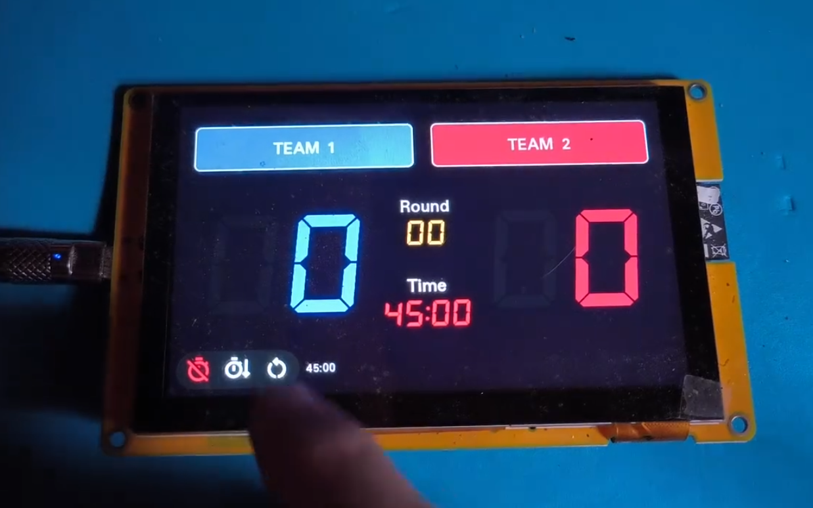

## ดีโม ScoreBoard สำหรับ Maker ที่ใช้ จอสัมผัส BeeNeXT 5 นิ้ว, BeeNeXT 7 นิ้ว (800x480px)

https://web.facebook.com/share/p/18cBpjphNx/  

  

## จอสัมผัส BeeNeXT 
✅ ทำ IoT เชื่อมต่ออุปกรณ์ทางไกลได้  
✅ บันทึกข้อมูล (Datalog) ลง SD Card พร้อมใช้  
🔊 รองรับ I2S เล่นเพลง MP3 จาก SD Card  
ไฟล์ชื่อไทย ออกลำโพงได้!  
(ปกติ Arduino เล่นไฟล์ชื่อไทยไม่ได้) 🎶  
🔥 พิเศษ! คอร์สสอนออกแบบ UI กราฟิกให้ฟรี!  
ใช้จอ BeeNeXT ทุกขนาด ไม่ต้องเสียค่าคอร์สแพงๆ  
สอนสด พร้อมตัวอย่าง 100-200 ตัวอย่าง  
การทำ IoT, การทำ Datalog  
  
🆓 ฟรี! โค้ด DEMO นำไปพัฒนาต่อได้ !!  
📌 แล้วโปรเจกต์ของคุณจะก้าวไป  
ปลดล็อกขีดจำกัด จินตนาการ! 💡  

  
